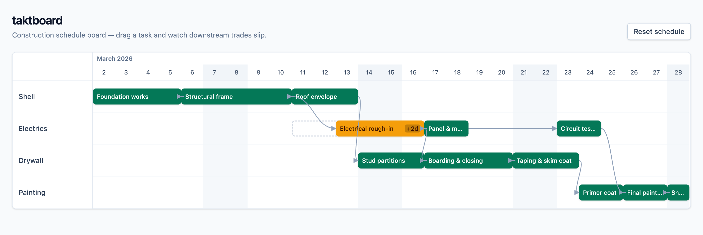
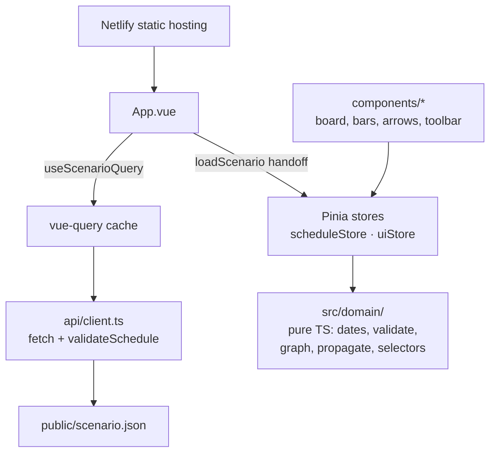

# taktboard

A construction schedule timeline board with delay propagation. Trades own
day-granular tasks linked by finish-to-start dependencies; drag a task and
every downstream task that would now start too early is pushed right, with the
ripple visible on the board. Standalone portfolio project — the engineering
process (tiered plan, ADRs, TDD, AI-workflow log) is part of the deliverable,
not just the pixels.

**Live:** <https://taktboard.netlify.app/>



## Quick start

```sh
git clone https://github.com/husnukirci/taktboard.git
cd taktboard
npm ci
npm run dev
```

Then open the printed URL, drag **Electrical rough-in** a few days right, and
watch the drywall and painting trades slip after it. **Reset schedule** puts
everything back on baseline. Task bars are keyboard-operable too: focus one
with Tab, move it with ←/→.

Other scripts: `npm test` (vitest), `npm run typecheck`, `npm run lint`,
`npm run build`.

## Architecture



The load path runs top-down: the host serves a static SPA, `App.vue` fetches
`scenario.json` through a typed client that validates every response at the
boundary, vue-query owns caching/retry policy, and a single `watchEffect`
handoff copies the validated schedule into the Pinia store. From there the UI
is store-driven: components read the store, never the query; the store holds
no rules of its own and delegates every decision (propagation, delays, lanes)
to the pure-TypeScript domain core. Bars are HTML in one CSS grid and
dependency arrows are one SVG overlay; both derive positions from the same
tested geometry module, never DOM measurement.

## Tech choices

Every load-bearing choice has an ADR in [docs/decisions.md](docs/decisions.md).

| Choice                                        | Instead of                         | ADR                                                                                                  |
| --------------------------------------------- | ---------------------------------- | ---------------------------------------------------------------------------------------------------- |
| Vue 3 `<script setup>` + composition API only | Options API mix                    | [ADR 1](docs/decisions.md#adr-1--vue-3-script-setup--composition-api-only)                           |
| Pinia stores as thin adapters                 | Hand-rolled reactive stores        | [ADR 2](docs/decisions.md#adr-2--pinia-for-state-over-hand-rolled-reactive-stores)                   |
| Framework-free domain core (`src/domain/`)    | Logic in stores/components         | [ADR 3](docs/decisions.md#adr-3--domain-core-as-a-pure-typescript-module)                            |
| CSS grid + SVG overlay, no libraries          | Canvas or a Gantt library          | [ADR 4](docs/decisions.md#adr-4--timeline-as-css-grid--svg-overlay)                                  |
| Day-granular ISO dates, exclusive end         | `Date` arithmetic in components    | [ADR 5](docs/decisions.md#adr-5--day-granular-iso-dates-exclusive-task-end)                          |
| Eager topological delay push                  | Constraint solver / lazy selectors | [ADR 6](docs/decisions.md#adr-6--delay-propagation-as-an-eager-topological-push)                     |
| Netlify hosting + GitHub Actions CI           | Single coupled pipeline            | [ADR 7](docs/decisions.md#adr-7--netlify-for-hosting-github-actions-for-ci)                          |
| fetch → typed client → vue-query              | axios, Pinia Colada                | [ADR 9](docs/decisions.md#adr-9--data-loading-fetch--typed-client--vue-query-pinia-for-client-state) |

## Repo orientation

```
src/
  domain/        pure TS schedule engine: types, dates, validate, graph,
                 propagate, selectors — zero Vue imports, strict TDD
  state/         Pinia stores: scheduleStore (schedule + moves),
                 uiStore (drag/hover/selection)
  api/           typed fetch client; boundary validation lives here
  composables/   useScenarioQuery (vue-query), useTaskDrag (pointer lifecycle)
  ui/            shared presentation math: geometry (grid/pixel mapping),
                 edgePath (arrow beziers), delayLevel, announce
  components/    presentational Vue components: board, header, bars,
                 dependency layer, toolbar
public/
  scenario.json  seed data — the stand-in API (schema in docs/api.md)
docs/            decisions.md (ADRs), ai-workflow.md, api.md
PLAN.md          goals, tiered scope, build order
PHASES.md        self-contained phase specs (one phase = one PR)
```

## Process

Built in seven phases, one PR each, with a working agreement in
[CLAUDE.md](CLAUDE.md): strict red-green-refactor TDD for the domain core and
store actions, tests-after for composables, a single smoke test for
presentational components. The AI-assisted workflow — including where
generated code was wrong and how review or tests caught it — is logged
honestly in [docs/ai-workflow.md](docs/ai-workflow.md).

- [PLAN.md](PLAN.md) — goals, tiered scope, build order
- [PHASES.md](PHASES.md) — the seven phase specs
- [docs/decisions.md](docs/decisions.md) — architecture decision records
- [docs/ai-workflow.md](docs/ai-workflow.md) — AI workflow log and reflection
- [docs/api.md](docs/api.md) — scenario schema and store surface (the backend seams)

## Measurements (v1.0.0)

- Bundle (production build, gzipped): **43.8 kB JS**, 3.9 kB CSS.
- Lighthouse on the production deploy (desktop): **100 accessibility,
  100 best practices, 100 SEO**; LCP 88 ms, CLS 0.00 (lab, unthrottled).
- Drag-frame scripting under 4× CPU throttle: median 1.1 ms, p95 1.5 ms
  per preview frame (measurement method in PR #7).

## Roadmap

v1 is deliberately a Tier 1 cut ([PLAN.md](PLAN.md) has the full tiers):

- **Tier 2** — multi-tab sync via `BroadcastChannel` behind a `SyncAdapter`
  interface (shaped so a WebSocket gateway can replace it), JSON
  import/export, critical-path highlighting, live ripple preview during drag.
- **Tier 3** — NestJS + Prisma + PostgreSQL backend, persistence, auth,
  undo/redo, working-day calendars, resource conflicts, virtualization,
  mobile layout.

Non-goal: production readiness. This is a focused demo of domain modeling,
UI craft, and process — and says so.

## License

[MIT](LICENSE)
